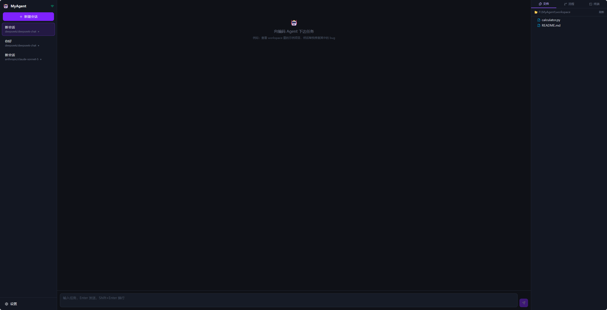

# MyAgent — 自托管类 Codex 编码 Agent


> 在浏览器里向一个编码 Agent 下发任务（"修复这个 bug"、"实现某某功能"），Agent 自主调用工具——读写文件、搜索代码、执行命令——全程实时展示每一步的流式输出、工具调用、审批与结果。支持 **Anthropic Claude / OpenAI / DeepSeek / Ollama** 多模型。

界面为中文。类 Codex / Claude Code 的自托管替代品，数据全部存在你自己的机器上。

---

## ✨ 功能特性

- 💬 **流式对话**：Agent 输出逐字实时展示，支持 Markdown 渲染与代码高亮
- 🔧 **工具调用循环**：Agent 可自主调用 `read_file` / `write_file` / `list_dir` / `glob` / `grep` / `bash`
- 🃏 **工具卡片**：每个工具调用渲染为卡片——入参、结果、耗时、状态（进行中/成功/失败），可展开查看
- 🛡️ **权限审批**：`bash` 等高危工具执行前需用户确认，可在设置中改为自动允许
- 📂 **工作区面板**：文件树展示目录结构，被修改的文件高亮，点击可在 Monaco 编辑器中查看
- 🖥️ **进阶面板**：xterm.js 终端回放、React Flow 任务流程图、会话导出 Markdown
- 💾 **会话持久化**：SQLite 落盘，重启不丢，历史会话可继续对话（上下文恢复）
- 🧩 **多模型**：LiteLLM 统一接入，设置页切换，一键换 DeepSeek / OpenAI 兼容端点 / Ollama 本地
- ⏹️ **停止/中断**：运行中可随时停止当前 Agent 循环

## 🖼️ 界面预览



> 左侧会话列表 · 中间对话流与工具调用卡片 · 右侧文件树 / 流程图 / 终端面板

## 🚀 快速开始

### 前置要求

| 依赖 | 版本 | 用途 |
|---|---|---|
| Python | ≥ 3.10 | 后端（FastAPI + LiteLLM） |
| Node.js | ≥ 20.19（Vite 8 要求） | 前端（Vite dev server） |
| npm | 随 Node.js | 前端依赖 |

### 方式一：一键脚本（推荐）

```bash
git clone https://github.com/lambda0302/MyAgent.git
cd MyAgent
```

- **Windows**：双击 `setup.bat`（自动建 venv、装后端依赖、`npm install`、生成 `backend/.env`）
- **macOS / Linux**：运行 `bash setup.sh`

完成后：
1. 编辑 `backend/.env` 填入你的 API Key
2. 双击 `start.bat`（或运行 `bash start.sh`）启动
3. 浏览器打开 <http://localhost:5173>，右上角状态灯变绿即连通

### 方式二：手动

**后端（端口 8000）：**

```bash
cd backend
python -m venv venv                        # 首次
./venv/Scripts/pip install -r requirements.txt   # 首次（macOS/Linux: venv/bin/pip）
./venv/Scripts/python run.py               # macOS/Linux: venv/bin/python run.py
```

> 也可用 `uvicorn app.main:sio_app --host 127.0.0.1 --port 8000`。注意入口是 **`sio_app`**（Socket.IO ASGI 应用），不是 `app`。

**前端（端口 5173）：**

```bash
cd frontend
npm install        # 首次
npm run dev
```

浏览器打开 <http://localhost:5173>。

### 停止

两个窗口分别按 `Ctrl+C`；或 Windows 运行 `stop.bat`。

## 🔑 配置 API Key

二选一（**页面配置**最方便，写入 SQLite 重启不丢）：

1. **页面配置**：右上角 ⚙️ 设置 → 选择模型 → 填入对应 Key → 保存
2. **环境变量**：编辑 `backend/.env`（后端启动时读取，**优先级高于**页面配置）

| 环境变量 | 对应模型 | 说明 |
|---|---|---|
| `ANTHROPIC_API_KEY` | `anthropic/*` | Claude |
| `OPENAI_API_KEY` | `openai/*` | GPT 系列 |
| `DEEPSEEK_API_KEY` | `deepseek/*` | DeepSeek（OpenAI 兼容） |
| `OLLAMA_BASE_URL` | `ollama/*` | 本地推理，如 `http://localhost:11434` |

> 💡 **DeepSeek**：模型选 `deepseek/deepseek-chat` 或 `deepseek/deepseek-reasoner`，Key 填在设置页 DeepSeek 输入框即可；端点默认 `https://api.deepseek.com`，可改 `deepseek_base_url`。DeepSeek 原生支持工具调用，Agent 工具循环完整可用。
>
> 💡 **中转/兼容端点**：可通过 `ANTHROPIC_BASE_URL` + `ANTHROPIC_AUTH_TOKEN` 使用 Anthropic 兼容网关（本项目已针对中转做工具格式兼容）；也可在设置页配置 OpenAI 兼容端点配合 `openai/*` 模型。

## ⚙️ 配置项

均可在设置页修改（后端 `backend/app/config.py`）：

| 键 | 默认 | 说明 |
|---|---|---|
| `workspace_root` | `./workspace` | Agent 工作目录（工具调用仅限此目录内） |
| `default_model` | `anthropic/claude-sonnet-5` | 默认模型（LiteLLM 命名） |
| `auto_approve_bash` | `false` | 为 `true` 时 bash 免审批直接执行 |
| `max_steps` | `25` | 单次任务最大工具调用轮数 |
| `max_tokens` | `8192` | 单轮模型最大输出 token |
| `bash_timeout` | `120` | bash 命令超时（秒） |

## 🏗️ 架构

前后端分离的两个进程，通过 HTTP + Socket.IO 通信：

```
┌─────────────────────────────────────────────┐
│  Web 前端 (React 19 + Vite + TS + Tailwind) │
│  Monaco · xterm.js · React Flow · zustand   │
└────────────────────┬────────────────────────┘
                     │ HTTP (REST) + Socket.IO (实时)
┌────────────────────▼────────────────────────┐
│  后端 (Python FastAPI + Uvicorn)             │
│  · Agent 引擎（工具调用循环）                 │
│  · LiteLLM 统一 LLM 接入（Claude/OpenAI/     │
│    DeepSeek/Ollama）                         │
│  · 工具集：file / bash / grep / glob        │
│  · 权限审批中间层（asyncio.Future）          │
│  · SQLite + SQLAlchemy（会话持久化）         │
└─────────────────────────────────────────────┘
```

核心实时事件（Socket.IO）：`chat.message` 流式增量 · `agent.status` · `tool.start/tool.result` · `approval.request/respond` · `file.changed` · `message.saved`

## 🧪 测试

```bash
cd backend
PYTHONIOENCODING=utf-8 ./venv/Scripts/python.exe test_agent_loop.py
```

不依赖网络的 mock 测试，覆盖工具层（读写/列表/glob/grep/bash/越界保护/审批）与 Agent 循环（工具调用→结果→持久化）。

## 📁 项目结构

```
.
├── docs/            调研报告、需求说明、验收文档
├── backend/         FastAPI + Socket.IO 后端
│   ├── app/         核心：agent 循环 / llm / tools / ws / routes / db / models / config
│   ├── test_agent_loop.py  离线测试
│   └── data/app.db  SQLite 数据文件（运行时生成，不入库）
├── frontend/        React 19 + Vite 前端
│   └── src/         store(socket 状态) / socket / api / components
├── workspace/       示例工作目录（含 calculator.py 演示项目）
├── setup.bat / setup.sh   一键部署（clone 后首次运行）
├── start.bat / stop.bat / start.sh   一键启动 / 停止
└── .env.example     环境变量模板（复制为 backend/.env）
```

## 📚 文档

| 文件 | 说明 |
|---|---|
| `docs/01-技术栈调研报告.md` | GitHub 类 Codex / 自托管 Agent 项目调研（OpenHands、AutoGPT 等 24+ 项目） |
| `docs/02-项目说明与需求.md` | 项目说明书：定位、需求、架构、里程碑 |
| `docs/03-验收文件.md` | 验收清单：启动 / 对话 / 工具 / 工作区 / 模型 / 安全 |

## 🔒 数据与安全

- **会话/设置落盘**：`backend/data/app.db`（SQLite）。删除即清空会话。
- **密钥保护**：`.gitignore` 已排除 `.env`、`*.key`、`*.pem`、`backend/data/`；代码中无明文密钥。
- **路径受限**：`read_file/write_file/list_dir` 解析路径时做越界检查，越界直接拒绝。
- **高危命令审批**：`bash` 默认需用户确认后执行。
- **本地运行**：数据与代码都在本机，不自带云端服务。

## 📄 License

[MIT](./LICENSE)
